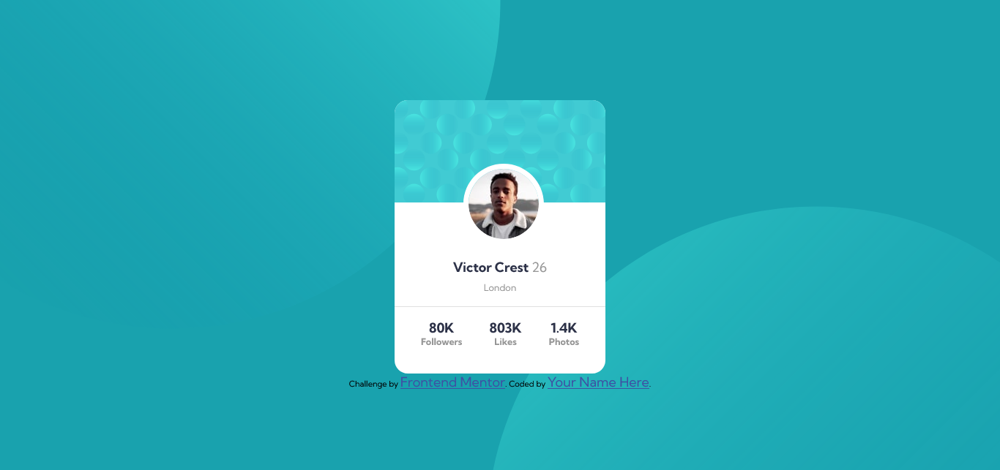

# Frontend Mentor - Profile card component solution

This is a solution to the [Profile card component challenge on Frontend Mentor](https://www.frontendmentor.io/challenges/profile-card-component-cfArpWshJ). Frontend Mentor challenges help you improve your coding skills by building realistic projects.

## Table of contents

- [Overview](#overview)
  - [The challenge](#the-challenge)
  - [Screenshot](#screenshot)
  - [Links](#links)
- [My process](#my-process)
  - [Built with](#built-with)
  - [What I learned](#what-i-learned)
  - [Continued development](#continued-development)
  - [Useful resources](#useful-resources)
- [Author](#author)

## Overview

### The challenge

- Build out the project to the designs provided

### Screenshot



### Links

- Solution URL: (https://your-solution-url.com)
- Live Site URL: (https://your-live-site-url.com)

## My process

### Built with

- Semantic HTML5 markup
- CSS custom properties
- Flexbox
- Mobile-first workflow

### What I learned

I learned how to better implement the mobile-first design with fewer lines of code. Also learned to better comment my conde and create CSS variables with more helping names.

```css
:root {
  /* Custom font family */
  --font-family: "Kumbh Sans", sans-serif;
  /* Primary colors */
  --Dark-cyan: hsl(185, 75%, 39%);
  --Very-dark-desaturated-blue: hsl(229, 23%, 23%);
  --Dark-grayish-blue: hsl(227, 10%, 46%);
  /* Neutral colors */
  --Dark-gray: hsl(0, 0%, 59%);
  --font-size: 18px;
}

@media (min-width: 768px) {
  body {
    background-position: top -25rem left -36rem, right -37rem bottom -30rem;
  }
  .wrapper {
    max-width: 16rem;
  }
}
```

### Continued development

With what I learned in this project, I'll be able to better adapt the layouts to mobile-first designs.

### Useful resources

- (https://developer.mozilla.org/en-US/docs/Web/CSS/background-position) - This helped me better position the background patterns that had to be placed for this project.

## Author

- Frontend Mentor - [@branalex94](https://www.frontendmentor.io/profile/branalex94)
- GitHub - [@branalex94](https://github.com/branalex94/)
